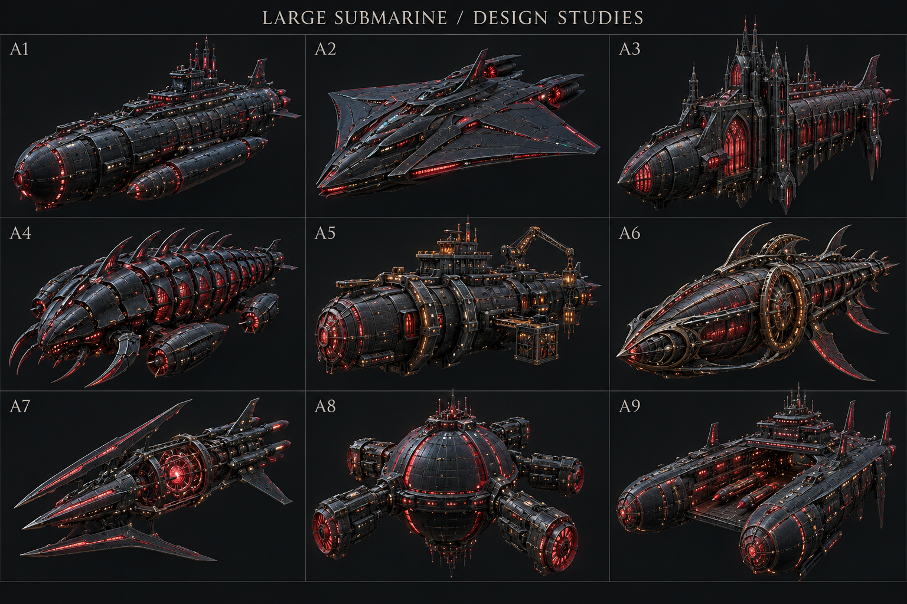
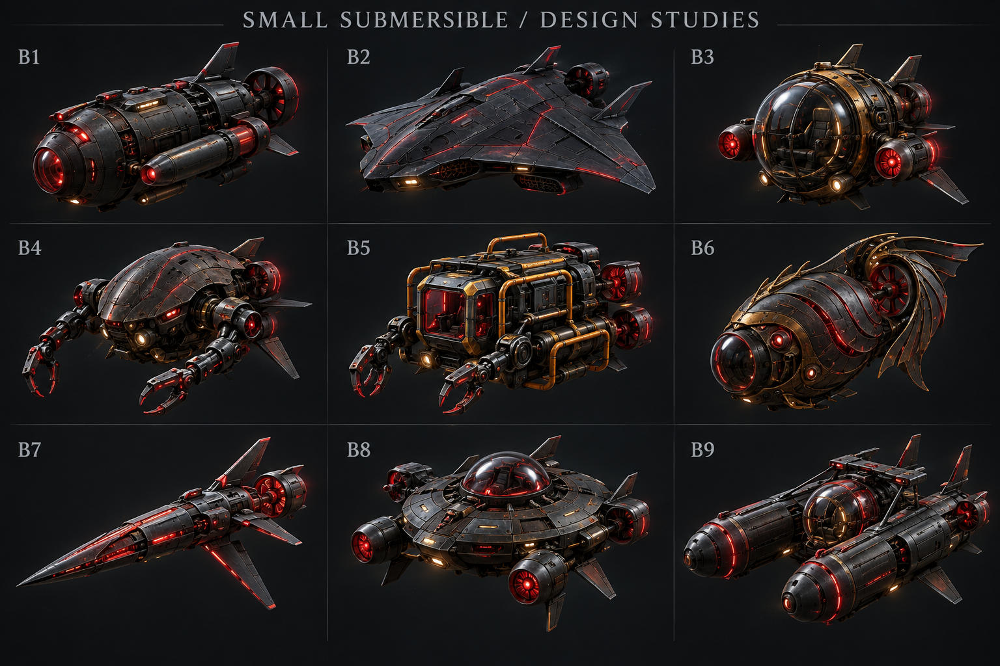

# Submarine Design Studies

2026-10-01. Generated with the built-in image generation tool. These are shape-selection concept renders, not gameplay captures. Final ships remain particle representations; material polish shown here is not an implementation promise.

## Large Submarine

A1 Dreadnought; A2 Manta; A3 Cathedral; A4 Trilobite; A5 Industrial fortress; A6 Nautilus relic; A7 Spearhead; A8 Bathysphere; A9 Twin keel.

## Small Submersible

B1 Torpedo hunter; B2 Manta scout; B3 Antique bathysphere; B4 Crustacean; B5 Worksub; B6 Nautilus scout; B7 Needle; B8 Disk drone; B9 Twin pod.

Selection is awaiting user review. Large and small hulls are not remodeled before selection. The mechanical ocean guardian is a separately specified third phase.

## Generation Prompts

### Large

Use case: stylized-concept. Asset type: game submarine design selection sheet, NOT gameplay screenshot. Generate ONE landscape concept board with EXACTLY NINE radically different LARGE submarine boss designs, tidy 3 by 3 grid, clearly numbered A1 A2 A3 / A4 A5 A6 / A7 A8 A9. Each cell one fully visible isolated craft in same readable three-quarter perspective, nose toward lower left, equally large comparison scale with generous margin; no cropping, no environment scenes. The game is a vast dark undersea cavern made of luminous particles; artificial enemies use ruby red, coral crimson, restrained amber and cyan accents, with clearly readable charcoal mechanical volume, luminous particle seams and restrained elegant red radiance. Professional high-quality hard-surface 3D concept render, anatomical clarity and mechanical detail, strong silhouette, not noisy firework clouds. DIFFERENT SILHOUETTES AND DIFFERENT WORLD-BUILDING, not nine copies of a cigar: A1 armored dreadnought long pressure hull with imposing stepped conning tower, paired torpedo sponsons; A2 broad low manta-wing stealth submarine, severe wedge and twin jets; A3 tall Gothic abyss cathedral submarine with asymmetric towers and flying buttress fins; A4 segmented deep-sea trilobite armored crawler submarine with curved carapace and side propulsion pods; A5 heavy industrial mining fortress submarine with blunt bow, ring clamps, asymmetrical cranes; A6 ornate ancient ocean relic submarine, streamlined Nautilus shell curvature with rotating gear rings and elegant swept structures; A7 skeletal three-spined spearhead submarine with open central reactor cage and long aft thrusters; A8 globular bathysphere battleship with large central sphere, red pressure ribs and four articulated outriggers; A9 split-hull twin-keel submarine carrier, large open central channel with bridged command deck and torpedo galleries. All must unmistakably be underwater vehicles, not spaceships, not surface boats, no waterline, no generic circular UFO. Keep surfaces visible enough in normal room light. Neutral near-black comparison background, thin discreet cell dividers, no busy borders, no huge glow hiding geometry. Exact labels only title 'LARGE SUBMARINE / DESIGN STUDIES' and A1 through A9. Do not write descriptions in image. No logos, no watermark.

### Small

Use case: stylized-concept. Asset type: underwater game small submarine design selection board, concept art NOT gameplay. ONE landscape image, EXACTLY NINE unique small combat submersible vehicle designs, clean equal 3 by 3 grid, numbered B1 B2 B3 / B4 B5 B6 / B7 B8 B9. Title exact 'SMALL SUBMERSIBLE / DESIGN STUDIES'. No descriptions. All isolated fully visible at identical comparison scale, three-quarter view, bow toward lower left. Underwater vehicles for game in huge black ocean caverns made of particles, hostile artificial family ruby crimson luminous seams and restrained amber, matte charcoal metal, tasteful pinpoints of scarlet particles following structural edges. High-quality detailed hard-surface concept renders with pale soft rimlight and readable volume, dark neutral background, controlled bloom that NEVER hides silhouette. Must look notably smaller and more nimble than a battleship, no huge conning towers, no busy decorations pasted on all. Nine SIGNIFICANTLY DIFFERENT worlds/silhouettes: B1 compact torpedo hunter, short fat pressure hull and dual flank torpedo tubes; B2 broad low manta ray stealth drone, short swept fins and recessed twin water jets; B3 antique single-pilot bathysphere, spherical glass pressure cockpit, brass frame and little red side thrusters; B4 jointed crustacean-like inspection attack sub, bulbous carapace and a pair of thin articulated manipulator arms; B5 blunt industrial mini-worksub, yellow-orange safety piping, cubic pressure cage, red vents and compact paired manipulator claws; B6 elegant sea-relic nautilus scout, curved shell-shaped prow and ornate swept tail keel; B7 needle interceptor, very narrow elongated dart fuselage, three swept aft fins and small exposed luminous engine; B8 flattened disk-shaped deep-sea drone with central hemispherical pressure dome and four stubby radial water jets, no flying saucer imagery, strongly engineered underwater; B9 twin parallel torpedo pods around a small suspended center cockpit bridge, compact catamaran underwater silhouette. Each design has visible aquatic fins, water jet apertures or pressure hull clues; no spacecraft rocket exhaust, no surface ships. Blank background without scenery, discreet thin separators, no watermark, no trademark. Only exact title and numbers B1-B9.

