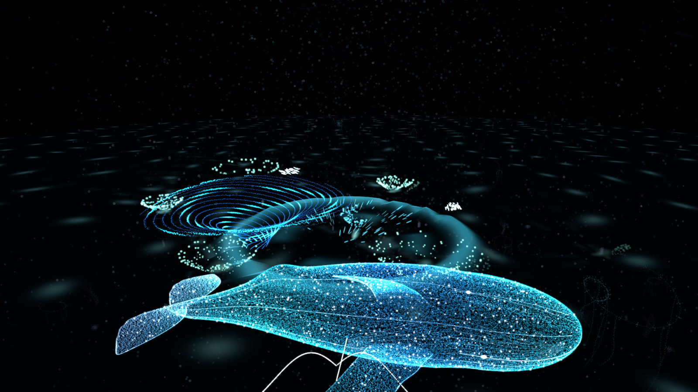

# LIMINAL / ABYSSAL CHOIR

Area X の視覚・音楽・操作の結びつきに着想を得た、オリジナルの音楽シューティング。
Unity 6 で、発光する五つの海底洞窟を自由に遊泳する探索・射撃体験を構築しています。
原作の音源、モデル、テクスチャ、商標ロゴは含みません。

## リポジトリ

このフォルダーが単独のUnityプロジェクト兼リポジトリです。
開発は `C:/repos/Antigravity/Liminal` と `bagybagy/Liminal` で継続します。
旧AgentRezは履歴保管用に残し、移行の内容は `REPOSITORY_MIGRATION.md` に記録しています。



上図は2026-10-01版のWindowsビルドからURP描画を直接取得した画像です。HUDは含みません。
三層の画像と形態変化の連続画像は実機検証後の `Verification/Caverns` にあります。
今回の発光階層・環境パルス・物質移行の設計は `VISUAL_REDESIGN.md` に記録しています。

## 起動

Windows: `Builds/Windows/Liminal.exe`。起動後、そのまま音楽とステージが始まります。
実行ファイルだけではなく、同梱の `Liminal_Data`、DLLなどを含む `Windows` フォルダー全体が必要です。完成ビルドもGitへ含めます。
Unity: このフォルダーを Unity Hub に追加し、6000.3.13f1 で開いてください。
`Assets/Liminal/Production/AbyssalChoir.unity` を開き、Play。

## 操作

| 操作 | 動作 |
| --- | --- |
| 左ボタンを押しながら中央照準で標的をなぞる | 最大8点をロック |
| 左ボタンを離す | 拍に予約された追尾射撃 |
| W / A / S / D | 向いている方向を基準に前後左右へ飛行 |
| Q / E | 下降 / 上昇 |
| Shift | ブースト（通常24m/s、最大52m/s） |
| マウス移動 | ドラッグ不要の視点旋回。プレイ中はカーソルを画面中央に固定 |
| Space | ゲージ満タン時にオーバードライブ |
| Escape | 一時停止、音量、明るさ、動きを抑える設定、再開・再挑戦 |

通常移動は静止から約0.7秒で24m/sへ加速します。入力を離すと惰性で減速し、約0.85秒で速度が5%になります。
ポーズやフォーカス喪失時はカーソルを解放します。

ポーズ画面の `BRIGHTNESS` は標準の見え方を基準に、露出を -1〜+3 EV で調整します。背景を見ながら変更でき、`DEFAULT` で元の明るさに戻せます。再開・終了時に設定をローカル保存します。HDRディスプレイ出力は無効で、内部HDRの発光をSDRへトーンマッピングしています。Bloom・粒子・ステージの元アセットは変更しません。

## 五つの洞窟

- **LANTERN GROTTO**: 青緑と真珠色の浅層。15体のクラゲは各2ヒットで反応します。1発目で収縮・発光し、2発目で恒久的な根付き植物の形が確定。別の場所へ移動する同じ粒子群が約10秒かけて植物状に定着します。
- **SERPENT SANCTUM**: 琥珀色の珊瑚が混じる中層。海蛇の16器官を撃つと、それぞれの近傍に被弾色が残ります。一巡すると器官と色が再点灯し、5巡・合計80ヒットで攻略。身体の粒子は、複数の群れが編み合わさるトルネード状の群泳へ変わります。
- **HORIZON WHALE**: 幅1,400m・奥行1,440m・高さ600mの深層で、青い大渦への接近から巨大ホエールの跳躍・着水・大波が始まります。登場完了後は水平半径330m x 400mの軌道を浮上・潜行し、48器官を累計96ヒットで攻略します。六つの被弾領域は同じ粒子を引き継いでイルカに変わり、高速遊泳と撃ち落とせる弾で応戦します。イルカは8つの体表ポイント・8ヒットで解放され、クジラの標的再生時には粒子として回収されます。クジラの標的は220m以内でロックできます。

ホエールの部屋には、洞窟の海底とは別に発光する第二の水平面があります。身体が水面に近づくと航跡が残り、浮上・潜行に伴って波紋と弧を描く飛沫が広がります。体光も浮上・旋回・被弾に応じて変化します。プレイヤーのカメラを演出で動かすことはありません。

- **TIDAL SHELLS**: 青緑と黄金の海底を歩く24体のヤドカリ。立体的な巻き貝と縦に折れた関節脚を持ち、接地中の足先は世界座標へ固定します。小型は4点・4ヒット。脚は音源譜面に同期し、拍・半拍・1/4拍・1/8拍の位相差で歩きます。8体を倒すと、その粒子が巨大個体へ合流します。小型は中速の泡、大型は頭上へ上昇してから落ちる中空の泡リングで攻撃。大型は従来の1.5倍のサイズ・16点・累計48ヒットで攻略。残った小型も同じ粒子のまま、巻き貝をモチーフにした大きな漁礁へ集まり、周囲を16匹の小魚が泳ぎます。
- **SCARLET ENGINE**: 赤い人工物の部屋。選定されたA1/A5を丸めたレトロな圧力船体から、一気に時代の進んだA7系の尖った小型潜水艇3体へ分裂し、最後は海底から立ち上がる機械仕掛けのポセイドンへ変形します。各形態の必要ヒット数は48・48・64。巨人は冠・関節腕・指・槍を持ち、体表の粒子が形状に沿って流れ続けます。「インドラの矢」の先端から予兆付きの青い電撃弾幕を発射し、プレイヤーは弾をロックして迎撃できます。粒子の個体と形状データを維持したGPUモーフで分離・集合し、最後は発光する機械礁へ変わります。選定用の9案ずつの画像は `Concepts` にあります。

初回はマウス、WASD、Q/E、ブースト、単発ロック、8点ロックを粒子の説明ボードで体験できます。対応する実入力と着弾で文字・図形が散り、漂う粒子として残ります。Escapeメニューから再体験・スキップできます。視点・移動を演出側で強制しません。
ヒット時の円は384個の発光粒子による二重の波紋と漂う光の粒で描きます。透視投影を補正し、遠距離でも画面上の大きさと明るさを保ちます。

部屋間の下降通路は常に開いています。攻略前でも先へ進み、戻ることができます。
クラゲから海蛇へ進むと、クジラ・ヤドカリ・潜水艦の三方向へ分岐します。ヤドカリからは海蛇・潜水艦・クジラ、潜水艦からは海蛇・ヤドカリ・クジラへ進めます。七本の通路は双方向に開いており、未攻略でも通過できます。部屋のHUDには各出口の行き先と距離を表示します。
開口部はレビューに合わせて、以前の滑らかな分割リングへ戻しました。各通路に3群・7匹、合計147匹の小魚を置いています。接近・被弾で散開して再集合し、奥への目印になります。壁の控えめな流動輪郭線は既存URPシェーダーによるものです。

## 討伐記録と余韻

ボスIDを実際の討伐時に記録し、部屋への再訪で重複加算しません。クジラへの接近時に継承能力を確定します。海蛇を倒していれば小魚・エイを召喚、ヤドカリを倒していればイルカが大きな泡リングを発射、潜水艦を倒していれば青い渦と槍の弾幕装置が登場。槍は8点を3巡、24ヒットで破壊できます。攻撃頻度は討伐数に応じて最大2倍です。

クジラ討伐後は敵の攻撃を停止し、自由遊泳を維持します。元のクジラ・イルカの粒子が海底のアトランティスへ集まり、共通の遺跡土台に、ヤドカリなら宮殿、海蛇なら周回する魚群、潜水艦なら非敵対の観測潜水艦を追加します。組み合わせは8通り。進行記録は今回のプレイ内だけで、再挑戦するとリセットします。

アトランティス付近で96秒の粒子クレジットが流れます。下方の粒子が文字を形成して上昇し、上端で散り、漂って次の文字へ再集合します。tete、採用技術、確認できた制作ワーカー名を表示し、一巡後は漂う光として残ります。
洞窟には魚群、平たく広がる珊瑚、管状海綿、海藻、触手状の群落があります。クラゲ、魚、ホエール由来の粒子は、変形・散開・移動・定着の間も同じ個体IDを保ちます。海蛇ステージの小型敵も撃破した点群を残し、海底の群落へ変化します。
魚は全体で196体（7群 x 28体）を個別に狙えます。撃つと周囲の魚も散開し、約8〜12秒で再集合してから再びロック可能になります。散開・再集合中も予約済みの射撃は有効です。
洞窟の境界と通路は描画・移動で共通の空間定義を使います。
現在は全編で `TidalMemory` をループ再生し、部屋移動・ボス会敵・エンドロールでも曲やDSP原点を切り替えません。探索に時間制限はありません。射撃音のDSP予約と譜面への同期は維持します。

## 旧アリーナ

起動引数 `--legacy-arena` で、以前の約3分20秒の海蛇戦を起動できます。
このモードでは小型の群れとの遭遇から始まり、主旋律の展開とともに海蛇の発光器官が開きます。
海蛇はプレイヤーと独立した三次元経路を回遊します。距離表示と画面端の方向表示を頼りに追跡し、
105m以内へ近づいてロックしてください。照準の取得半径は旧版の約1.7倍です。
取得済みのロックと発射済みの弾は、距離が離れても維持されます。
三つの音楽セクションで計240ヒット分の器官が開放されます。
敵の圧力弾は撃ち落とすか、移動して回避できます。
全器官を破壊するとクリア。耐久値が尽きるか、曲の終盤までに破壊できなければ失敗です。

## 実装

- 音楽: `TidalMemory` とその音源サンプル譜面を全編で使用。レビュー不合格のStageAudio・試聴曲は採用しません。将来の曲切り替え機構（四小節境界のDSP予約・二小節クロスフェード・曲ごとの譜面）は残し、`Experience.enableStageMusic` の明示的な有効化が必要です。既定は無効で、音量やVRの保存設定から自動有効化されることはありません。BPM推定器は使用しません。
- 時刻: BGM を `AudioSource.PlayScheduled` で開始し、DSP 原点を射撃、譜面、粒子変形、
  戦闘の共通基準にします。着弾音は音声スレッド上に予約、論理ダメージは対応する最初の描画フレームで反映します。
  射撃の先頭は表拍、後続は8分音符へ整列し、着弾時の和音に沿って音程を選びます。ループ周期も音源の正確なサンプル数を使います。
  初回起動は音源準備と再生予約を分け、重い初期化と最初のフレームが完了してから開始時刻を決定します。
- ロックオン: 標的のIDと予約ダメージを保持し、弾の物理衝突に命中判定を依存させません。
  動く標的への終点を毎フレーム更新する二次ベジェ軌道を使用します。
- 移動: ワールド座標を持つ遊泳リグと追従カメラ。約0.7秒の加速と指数減衰の惰性を使用。
  三層では楕円体の部屋とカプセル状の通路の合成領域にプレイヤー・カメラを制限します。
  半径約350mの外周復帰力は旧アリーナでのみ使用。背景はプレイヤーに追従しません。
- 海蛇: 頭部の通過経路を胴体・尾が時間差で追跡。CPU上の257点の骨格を標的とGPU描画が共有します。
- 描画: 専用Compute Shaderが262,144粒子の位置・速度・寿命を更新。体表の光、ひれの繊維、
  内部の光、世界空間に残る航跡を分け、半透明の発光膜を重ねています。
  `GraphicsBuffer` / `Graphics.RenderPrimitives` / URP HDR / Bloom を使用。
  この版はVFX Graphアセットではなく、共通骨格へ直接接続する専用GPUシミュレーションです。
- 永続する海洋粒子: 161,833個（浮遊する環境粒子16,000個を含む）をGPUで更新し、既存の海蛇粒子262,144個と併用します。クジラの106,124種点のうち26,448点はイルカへ変化する領域です。GPUバッファは再起動まで位置・速度・群・フェーズ・影響履歴と安定した個体IDを保持し、個々の粒子にGameObjectを割り当てません。洞窟の手続き配置物は別方式のままで、光の波と音源譜面による結束・浮遊に反応しますが、ワールド全体を永続GPU粒子へ置き換えたものではありません。VFX Graphアセットはこの実装では未作成で、既存のCompute Shader基盤を再利用しています。
- 設定: 音量、明るさ、Reduced Motion をローカル保存。
- 第二の水平面: 専用URPシェーダーの波面と、ワールド座標の有限イベント領域による航跡・飛沫。クジラの実際の位置・向き・速度から応答させます。水の流体計算やリアルな海面の再現ではなく、光る水面としての演出です。

## 再ビルド

Unity メニュー `Liminal > Build Windows Player`。
コマンドラインでも実行できます。

```powershell
& 'C:\Program Files\Unity\Hub\Editor\6000.3.13f1\Editor\Unity.exe' `
  -batchmode -quit -projectPath "$PWD" `
  -executeMethod Liminal.Editor.Production.BuildCurrent -logFile build.log
```

音源を変更するときは `node Tools/compose.mjs` を実行してから再ビルドします。
小節構成を変更する場合は作曲スクリプトのセクション定義も合わせて変更します。`Resources/TidalMemoryTimeline.json` は音源と一緒に生成されます。
`node Tools/audit-music.mjs` は書き出し済みPCM波形から拍の位相を監査します。研究資料と設計判断は [PARTICLE_DESIGN.md](PARTICLE_DESIGN.md) に記録しています。

## 実機検証

新エリアとチュートリアルの検証は、完成プレイヤーに `--verify-expansion --output Verification/Expansion` を渡します。通常の投影座標によるロック・音源譜面への射撃予約を通して両ステージの攻略、形態移行、再起動、近距離と遠距離の円の描画サイズを確認し、JSONと実描画画像を保存します。
造形改訂版は `--verify-expansion --review-only --output Verification/VisualReview` で、通路魚群、接地脚、泡リング、全個体の漁礁化、槍からの実発射も確認します。画像はポストエフェクトを含む通常のURP描画経路から取得し、PVの録画は行いません。

```powershell
./Tools/verify.ps1
```

実際の Windows プレイヤーを約3分起動し、通常操作と共通の飛行APIで海蛇を追跡し、
マウスと同じ投影座標のヒットテストでロック・射撃を実行します。
`Verification` にスクリーンショットと JSON レポートを出力します。
検査対象: 8点ロック、240点のボスダメージ、クリア、失敗、リスタート、一時停止中の時計停止、
音の予約時刻の譜面整合性、表示上の着弾遅延、実行時例外、GPU描画画像。
自由飛行の移動量、旋回後の向き保持、背景の座標不変、射程制限、取得済みロックの維持も検査します。
非表示時はウィンドウ描画が省略されるため、URPへの直接描画要求で画像を検証します。
描画とGPU読戻しの合計時間は記録しますが、非表示時のロジック更新頻度を実ゲームのFPSとは扱いません。
音響出力装置まで含む遅延や人間による操作感は、この自動検査では保証しません。

新しい三層の実機検証は `./Tools/verify-caverns.ps1`。加減速、両通路の通過、クラゲと魚群への射撃、
海蛇80ヒットとクジラ96ヒット、器官再点灯、回遊速度・洞窟内への収まり・浮上潜行、波と飛沫、ポーズ、リスタートと三室の描画を確認します。クジラ戦は標的へのワープを使わず、通常の飛行と中央照準による連続追跡で検査します。

大渦への実際の接近、登場前の非表示・ロック禁止、着水の大波、イルカへのIDを維持した形態変化、プレイヤー以上の実測速度、実際に発射された弾の迎撃、3ヒットでの解放・定着も検査します。最終Windowsビルドの実測結果は `Builds/Windows/VerificationReport.json` に同梱しています。
画像とJSONは `Verification/Caverns` に出力します。

永続粒子の検査では、個体IDの維持、FormからSettledまでの遷移、フェーズ遷移中にGPUバッファを再初期化しないこと、明示的な再起動時の初期化を確認し、実際の描画画像も保存します。最終実行の結果は `VALIDATION.md` に記録しています。

## PCVR

Windows版は同じビルドでデスクトップとPCVRを切り替えられます。OpenXRランタイムと接続したHMDが必要です。ポーズ画面のPCVRボタン、または起動引数 `--vr` で有効にします。Quest Link / Air Link等のPC接続を想定し、Quest単体用Androidビルドは含みません。

左スティック前後で頭の向く方向へ移動、左右で横移動。右スティック上下で世界の上下方向へ移動、左右で毎秒60度の連続旋回。左グリップでブースト。通常20m/s・ブースト40m/s、約0.7秒で加速し、斜め入力でも上限速度を超えません。右トリガー保持で視線を中心にロック、離して発射。A/Xでオーバードライブ、左メニューでポーズ。ポーズ中は右スティックで選択、右トリガーで確定。頭の実姿勢は補間・上書きせず、移動リグのみを旋回します。演出による視点旋回や人工的なロールは加えません。

VRのロック範囲は視野の中央70%を使う角度ベースの楕円、距離は通常の2倍（標準210m、クジラ器官440m）です。実HMDの左右眼の投影行列を使い、ミラーウィンドウの解像度に依存させません。洞窟の壁越しのロックは不可。取得済みの円と番号は距離に応じて太さと文字サイズを変え、見かけの大きさを維持します。

ポーズ画面からPCVRの起動に成功した際は自動で再開します。失敗時はデスクトップのポーズを維持。VR中は2Dメニューを描かず、ポーズ時だけワールドメニューを表示し、再開時は消します。

専用ワールドHUDとVR操作表示を使用し、マウス用チュートリアルはVR中に非表示にします。OpenXRはMultiPassを採用。HMDがない場合はデスクトップに戻ります。実HMDでの操作感・両眼描画・酔い・フレーム時間は別途確認が必要です。

実行結果と未保証の範囲は [VALIDATION.md](VALIDATION.md) を参照してください。

`--verify-player-feedback --output Verification/PlayerFeedback` は、このレビューに対応する短い検証です。TidalMemoryの継続、VR相当のカメラ姿勢での前後左右上下移動・速度上限・連続旋回・広い8点ロック・距離制限・壁越し禁止・番号付きHUD・ポーズ・拍同期を実行します。実HMDを接続するテストではないので、体感と両眼描画の確認は別途必要です。
