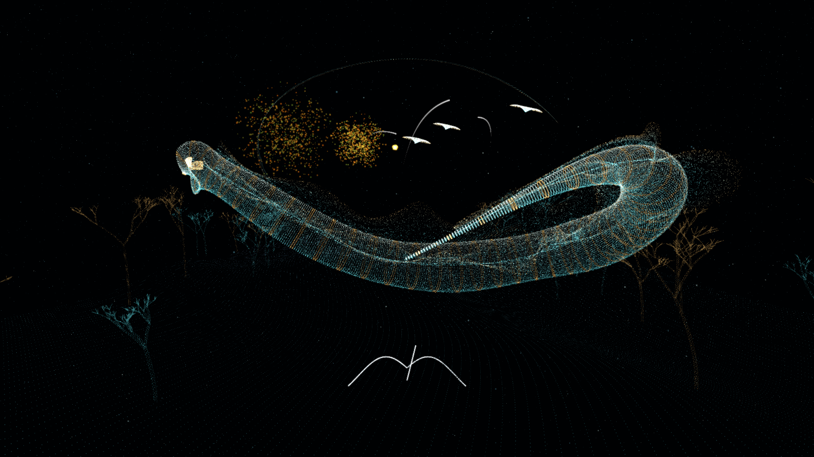

# LIMINAL / ABYSSAL CHOIR

Area X の視覚・音楽・操作の結びつきに着想を得た、オリジナルの音楽シューティング。
Unity 6 で、発光する三層の海底洞窟を自由に遊泳する探索・射撃体験を構築しています。
原作の音源、モデル、テクスチャ、商標ロゴは含みません。



上図は旧アリーナのURP描画を直接取得した画像です。HUDは含みません。
新しい三層の画像は実機検証後の `Verification/Caverns` にあります。

## 起動

Windows: `Builds/Windows/Liminal.exe`。起動後、そのまま音楽とステージが始まります。
Unity: このフォルダーを Unity Hub に追加し、6000.3.13f1 で開いてください。
`Assets/Liminal/Production/AbyssalChoir.unity` を開き、Play。

## 操作

| 操作 | 動作 |
| --- | --- |
| 左ボタンを押しながら中央照準で標的をなぞる | 最大8点をロック |
| 左ボタンを離す | 拍に予約された追尾射撃 |
| W / A / S / D | 向いている方向を基準に前後左右へ飛行 |
| Q / E | 下降 / 上昇 |
| Shift | ブースト（通常24m/s、最大52m/s） |
| マウス移動 | ドラッグ不要の視点旋回。プレイ中はカーソルを画面中央に固定 |
| Space | ゲージ満タン時にオーバードライブ |
| Escape | 一時停止、音量、動きを抑える設定、再開・再挑戦 |

通常移動は静止から約0.7秒で24m/sへ加速します。入力を離すと惰性で減速し、約0.85秒で速度が5%になります。
ポーズやフォーカス喪失時はカーソルを解放します。

## 三層の洞窟

- **LANTERN GROTTO**: 青緑と真珠色の浅層。15体のクラゲは各2ヒットで反応します。1発目で収縮・発光し、2発目で恒久的な根付き植物の形が確定。別の場所へ移動する同じ粒子群が約10秒かけて植物状に定着します。
- **SERPENT SANCTUM**: 琥珀色の珊瑚が混じる中層。海蛇の16器官へ合計80回命中すると、洞窟下部を巡る恒久的な光の流れへ変わります。
- **HORIZON WHALE**: 銀青色の深層。ホエールは従来の約1.8倍、全長約284m。水平半径80m x 96mの楕円軌道を上下にも泳ぎ、周囲の浮遊粒子を押し流します。8つの発光器官を奏でると、光の波と歌が返り、胴体の粒子は再出現せず岩礁の模様へ定着します。

部屋間の下降通路は常に開いています。攻略前でも先へ進み、戻ることができます。
洞窟には魚群、枝状の珊瑚、海藻、結晶状の群落があります。クラゲ、魚、ホエール由来の粒子は、変形・散開・移動・定着の間も同じ個体IDを保ちます。
魚は全体で196体（7群 x 28体）を個別に狙えます。撃つと周囲の魚も散開し、約8〜12秒で再集合してから再びロック可能になります。散開・再集合中も予約済みの射撃は有効です。
洞窟の境界と通路は描画・移動で共通の空間定義を使います。
曲は104小節の完成した音源をループし、探索に時間制限はありません。射撃音のDSP予約と譜面への同期は維持します。

## 旧アリーナ

起動引数 `--legacy-arena` で、以前の約3分20秒の海蛇戦を起動できます。
このモードでは小型の群れとの遭遇から始まり、主旋律の展開とともに海蛇の発光器官が開きます。
海蛇はプレイヤーと独立した三次元経路を回遊します。距離表示と画面端の方向表示を頼りに追跡し、
105m以内へ近づいてロックしてください。照準の取得半径は旧版の約1.7倍です。
取得済みのロックと発射済みの弾は、距離が離れても維持されます。
三つの音楽セクションで計240ヒット分の器官が開放されます。
敵の圧力弾は撃ち落とすか、移動して回避できます。
全器官を破壊するとクリア。耐久値が尽きるか、曲の終盤までに破壊できなければ失敗です。

## 実装

- 音楽: オリジナル曲 `Tidal Memory`、124 BPM、104小節、44.1 kHz ステレオ。
  `Tools/compose.mjs` で決定的に再生成できます。BPM推定器は使用しません。
- 時刻: BGM を `AudioSource.PlayScheduled` で開始し、DSP 原点を射撃、譜面、粒子変形、
  戦闘の共通基準にします。着弾音は音声スレッド上に予約、論理ダメージは対応する最初の描画フレームで反映します。
- ロックオン: 標的のIDと予約ダメージを保持し、弾の物理衝突に命中判定を依存させません。
  動く標的への終点を毎フレーム更新する二次ベジェ軌道を使用します。
- 移動: ワールド座標を持つ遊泳リグと追従カメラ。約0.7秒の加速と指数減衰の惰性を使用。
  三層では楕円体の部屋とカプセル状の通路の合成領域にプレイヤー・カメラを制限します。
  半径約350mの外周復帰力は旧アリーナでのみ使用。背景はプレイヤーに追従しません。
- 海蛇: 頭部の通過経路を胴体・尾が時間差で追跡。CPU上の257点の骨格を標的とGPU描画が共有します。
- 描画: 専用Compute Shaderが262,144粒子の位置・速度・寿命を更新。体表の光、ひれの繊維、
  内部の光、世界空間に残る航跡を分け、半透明の発光膜を重ねています。
  `GraphicsBuffer` / `Graphics.RenderPrimitives` / URP HDR / Bloom を使用。
  この版はVFX Graphアセットではなく、共通骨格へ直接接続する専用GPUシミュレーションです。
- 永続する海洋粒子: 131,353個（浮遊する環境粒子16,000個を含む）をGPUで更新し、既存の海蛇粒子262,144個と併用します。GPUバッファは再起動まで位置・速度・群・フェーズ・影響履歴と安定した個体IDを保持し、個々の粒子にGameObjectを割り当てません。洞窟の手続き配置物は別方式のままで、光の波には反応しますが、ワールド全体を永続GPU粒子へ置き換えたものではありません。VFX Graphアセットはこの実装では未作成で、既存のCompute Shader基盤を再利用しています。
- 設定: 音量と Reduced Motion をローカル保存。

## 再ビルド

Unity メニュー `Liminal > Build Windows Player`。
コマンドラインでも実行できます。

```powershell
& 'C:\Program Files\Unity\Hub\Editor\6000.3.13f1\Editor\Unity.exe' `
  -batchmode -quit -projectPath "$PWD" `
  -executeMethod Liminal.Editor.Production.Build -logFile build.log
```

音源を変更するときは `node Tools/compose.mjs` を実行してから再ビルドします。
小節構成を変更する場合は `Runtime/Score.cs` の譜面も合わせて変更してください。

## 実機検証

```powershell
./Tools/verify.ps1
```

実際の Windows プレイヤーを約3分起動し、通常操作と共通の飛行APIで海蛇を追跡し、
マウスと同じ投影座標のヒットテストでロック・射撃を実行します。
`Verification` にスクリーンショットと JSON レポートを出力します。
検査対象: 8点ロック、240点のボスダメージ、クリア、失敗、リスタート、一時停止中の時計停止、
音の予約時刻の譜面整合性、表示上の着弾遅延、実行時例外、GPU描画画像。
自由飛行の移動量、旋回後の向き保持、背景の座標不変、射程制限、取得済みロックの維持も検査します。
非表示時はウィンドウ描画が省略されるため、URPへの直接描画要求で画像を検証します。
描画とGPU読戻しの合計時間は記録しますが、非表示時のロジック更新頻度を実ゲームのFPSとは扱いません。
音響出力装置まで含む遅延や人間による操作感は、この自動検査では保証しません。

新しい三層の実機検証は `./Tools/verify-caverns.ps1`。加減速、両通路の通過、クラゲと魚群への射撃、
海蛇の80ヒット、ホエールの8器官、ポーズ、リスタートと三室の描画を確認します。
画像とJSONは `Verification/Caverns` に出力します。

永続粒子の検査では、個体IDの維持、FormからSettledまでの遷移、フェーズ遷移中にGPUバッファを再初期化しないこと、明示的な再起動時の初期化を確認し、実際の描画画像も保存します。最終実行の結果は `VALIDATION.md` に記録しています。

今回の反復では、ユーザー指定により追加の快適性・カメラ調整を見送っています。VR・ゲームパッドは未実装です。

実行結果と未保証の範囲は [VALIDATION.md](VALIDATION.md) を参照してください。
